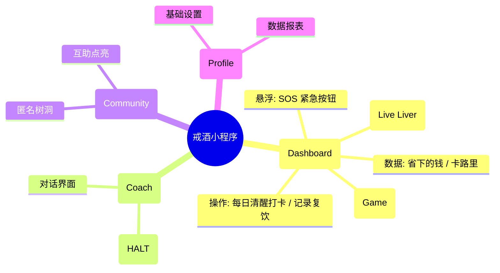

# 产品需求文档 (PRD)：口渴么

> **文档状态**: V1.1 (完整版)  
> **最后更新**: 2026-01-14  
> **文档作者**: bowei  
> **项目类型**: 微信小程序

---

## 目录

- [1. 项目概述](#1-项目概述)
  - [1.1 背景与痛点](#11-背景与痛点)
  - [1.2 产品愿景](#12-产品愿景)
  - [1.3 核心用户画像](#13-核心用户画像)
- [2. 产品架构与核心流程](#2-产品架构与核心流程)
  - [2.1 产品功能架构图](#21-产品功能架构图)
  - [2.2 核心业务流程图](#22-核心业务流程图)
- [3. 功能详情](#3-功能详情)
  - [3.1 F1: 首页仪表盘与生命肝脏](#31-f1-首页仪表盘与生命肝脏-p0)
  - [3.2 F2: 酒精后果模拟室](#32-f2-酒精后果模拟室-p1)
  - [3.3 F3: SOS 紧急干预](#33-f3-sos-紧急干预-p0)
  - [3.4 F4: AI 戒酒教练](#34-f4-ai-戒酒教练-p1)
- [4. 商业与风险](#4-商业与风险)
  - [4.1 商业化路径](#41-商业化路径)
  - [4.2 风险控制](#42-风险控制)
- [5. 数据埋点需求](#5-数据埋点需求)

---

## 1. 项目概述

### 1.1 背景与痛点

酒精依赖是一个复杂的生理和心理问题。传统戒酒工具枯燥乏味，缺乏即时反馈。用户往往因为"看不见伤害"而心存侥幸，又因为"看不见恢复"而半途而废。

### 1.2 产品愿景

打造一款**"可视化、游戏化、AI化"**的口袋戒酒教练。

- **可视化**：将看不见的肝脏健康变成看得见的"电子宠物"（生命肝脏）。
- **游戏化**：通过模拟饮酒小游戏（后果模拟室），让用户在虚拟世界体验"后果"，从而在现实中保持清醒。
- **AI化**：提供 24h 情感陪伴与危机干预。

### 1.3 核心用户画像

- **视觉型用户**：需要看到具体变化才有动力坚持。
- **冲动型饮酒者**：容易在特定场景（聚会、压力）下破戒，需要"后果模拟"来震慑。

---

## 2. 产品架构与核心流程

### 2.1 产品功能架构图

### 2.2 核心业务流程

用户使用 App 主要有两种场景：**"日常打卡"** 和 **"想喝酒时体验后果"**。

#### 场景一：日常打卡流程

这是用户每天都会使用的核心功能：

1. **打开 App** → 看到首页的"生命肝脏"和两个按钮
2. **如果今天保持清醒** → 点击"今日清醒打卡"
   - 屏幕飘落金币（显示省下的钱）
   - 肝脏变得更亮、更健康
   - 清醒天数 +1
3. **如果今天喝了酒** → 点击"记录饮酒"
   - 填写喝了什么、喝了多少
   - 肝脏变黑、状态变差
   - 清醒天数重置为 0
   - 系统会鼓励你："没关系，重新开始！"

#### 场景二：想喝酒时的"后果模拟"

当你想喝酒时，先来虚拟世界体验一下后果：

**第一步：进入模拟室**
- 点击首页的"酒精后果模拟室"
- 进入一个虚拟的饮酒场景

**第二步：选酒和倒酒**
- 从四种酒中选择：啤酒、红酒、威士忌、白酒
- 点击"倒酒"按钮，酒水倒入杯中
- 伴随逼真的倒酒声效

**第三步：模拟喝酒**
- 长按酒杯，模拟喝酒动作
- 手机会随着吞咽节奏震动
- 喝得越多，震动越强烈、越混乱

**第四步：体验后果**
- **视觉上**：屏幕变模糊、出现重影（模拟醉酒视角）
- **听觉上**：听到耳鸣声、沉重的心跳声
- **身体上**：肝脏迅速变黑、出现斑点、开始抽搐

**第五步：混饮警告（重点！）**
- 如果你喝了啤酒又喝白酒（混饮）
- 系统会弹出警告："混饮伤害翻倍！肝脏超负荷！"
- 健康数值会暴跌

**第六步：选择继续或清醒**
- **还能喝吗？** → 继续选酒、倒酒、喝酒（伤害越来越大）
- **受不了了** → 点击"喝水解酒"
  - 屏幕逐渐变清晰
  - 肝脏颜色慢慢恢复
  - 看到警示语："在虚拟世界你可以重来，但现实的肝脏只有这一个"

---

**简单总结：**
- **日常打卡**：保持清醒 → 肝脏变好；喝了酒 → 肝脏变差
- **模拟体验**：想喝酒 → 先在虚拟世界体验后果 → 被吓到 → 现实中不喝了

这就是通过"虚拟恐惧"来帮助用户在现实中保持清醒的核心逻辑。

---

## 3. 功能详情

### 3.1 F1: 首页仪表盘与生命肝脏 [P0]

#### 3.1.1 正向打卡机制

**设计逻辑**：首页主要服务于"成功场景"。

- **主按钮**：**"今日清醒打卡"**。点击后，屏幕飘落金币（代表省下的钱），清醒天数+1。
- **次级入口**：**"记录饮酒"**（折叠或位于角落）。点击后进入复盘流程，扣除健康值，不进行道德审判。

#### 3.1.2 饮酒记录弹窗表单

当用户点击"记录饮酒"按钮时，弹出模态对话框表单，用于记录详细的饮酒信息。

##### 弹窗UI设计

- **标题**："记录饮酒信息"
- **关闭按钮**：右上角 × 图标，可关闭弹窗
- **表单字段**：

| 字段 | 类型 | 必填 | 说明 | 选项/示例 |
|------|------|------|------|-----------|
| **酒的类型** | 单选 | 是 | 选择酒的类别 | 啤酒、红酒、白酒、威士忌、黄酒、鸡尾酒、其他 |
| **酒的名字** | 文本输入 | 否 | 具体品牌或名称 | 如：青岛啤酒、茅台、杰克丹尼等 |
| **酒的量** | 数字输入 | 是 | 饮用量 | 根据酒类自动显示单位（啤酒/红酒：ml，白酒/威士忌：两） |
| **饮酒时间** | 时间选择 | 否 | 何时饮酒 | 默认当前时间，可修改 |
| **备注** | 文本域 | 否 | 其他说明 | 如：聚会、应酬、情绪状态等 |

##### 表单验证规则

- **酒的类型**：必选，默认不选中
- **酒的名字**：选填，最多20个字符
- **酒的量**：必填，必须为正数
  - 啤酒：范围 50-3000 ml
  - 红酒：范围 50-1500 ml
  - 白酒：范围 0.5-10 两
  - 威士忌：范围 0.5-10 两
  - 其他酒类：根据类型动态调整范围

##### 交互流程

1. 用户点击"记录饮酒"按钮
2. 弹出模态对话框，显示表单
3. 用户选择酒的类型，系统自动调整"酒的量"的单位
4. 用户填写酒的名字和数量
5. 点击"确认记录"按钮
6. 系统验证表单数据
   - 验证通过：保存记录，关闭弹窗，显示反馈提示
   - 验证失败：显示错误提示，高亮错误字段
7. 首页显示饮酒记录后的状态变化：
   - 清醒天数重置为0
   - 肝脏状态根据饮酒量相应变化
   - 显示鼓励性提示："没关系，记录是为了更好地重新开始"

##### 数据存储

- 每条饮酒记录包含：用户 id、时间戳、酒类类型、酒名、数量、备注
- 数据存储在服务器中
- 可在"我的"页面查看历史饮酒记录

##### 反馈提示示例

- 成功："已记录本次饮酒，明天重新开始！"
- 验证失败："请填写完整的饮酒信息"
- 数量超出范围："饮酒数量超出合理范围，请确认"

#### 3.1.3 生命肝脏系统

**定义**：一个 3D 渲染或高质量插画风格的肝脏模型，作为用户健康的直观映射，展示用户当前的liver状态和健康指标。不同指标的图片会根据用户的状态和数据动态切换。图片从数据库中获取，确保实时更新。

**状态演变表**：

| 阶段 | 清醒时长 | 视觉描述 | 动画/特效 |
|------|----------|----------|-----------|
| **危机期** | 复饮 / 初始 | **深褐色/暗红色**，表面粗糙，有炎症斑点。 | 沉重且缓慢的跳动，背景灰暗。 |
| **修复期** | 1 - 7 天 | **红褐色转浅红**，消肿，斑点开始消退。 | 跳动变有力，偶尔出现绿色修复粒子光效。 |
| **健康期** | 30 天+ | **粉嫩有光泽**，表面光滑。 | 轻盈跳动，背景明亮清澈。 |
| **完美期** | 90 天+ | **晶莹剔透**，散发金色柔光。 | 超级形态，拥有神圣感的光环。 |

**交互**：点击肝脏，弹出 Tooltip 显示医学数据（如："脂肪肝风险已降低 15%"）。

---

### 3.2 F2: 酒精后果模拟室 [P1]

> **设计目的**：利用"虚拟宣泄"和"恐惧管理"，在用户想喝酒时，通过模拟体验打消现实念头。

#### 3.2.1 界面与道具

- **视觉风格**：半透明人体透视视角，科技感与医学感结合。
- **道具库**：
  - **啤酒** + 扎啤杯 (伤害值: Low)
  - **红酒** + 高脚杯 (伤害值: Mid)
  - **威士忌** + 古典杯 (伤害值: High)
  - **白酒** + 小酒盅 (伤害值: Critical)
  - **解酒水** (特殊道具：用于恢复)

#### 3.2.2 核心交互逻辑

**1. 选酒与倒酒**

点击酒瓶，酒液伴随逼真的 `液体声效`（咕嘟声）注入对应的杯中。

**2. 沉浸式饮用**

- 用户需 **长按酒杯** 模拟喝酒。
- **触感反馈**：手机随吞咽节奏震动。随着摄入量增加，震动变得杂乱、狂暴。

**3. 实时后果反馈**

- **视觉**：屏幕应用 `模糊滤镜` 和 `重影特效`，模拟醉酒视角。
- **听觉**：背景音中出现耳鸣声、沉重的心跳声。
- **器官**：界面中央的肝脏模型迅速变黑、出现斑点、抽搐。

**4. 混饮伤害叠加 (Combo System)**

- 如果在短时间内切换酒类（如喝完啤酒喝白酒），触发 **"混饮暴击"**。
- 系统弹幕警告："混饮导致吸收率提升 200%！肝脏超负荷！"
- 健康数值呈指数级下跌。

#### 3.2.3 结束与救赎

- **休克模拟**：当伤害值爆表，屏幕瞬间黑屏，模拟"断片/送医"。
- **一键清醒 (Redemption)**：
  - 提供一杯"虚拟矿泉水"。点击饮用后，滤镜逐渐清晰，肝脏颜色缓慢回升。
  - **结语**：弹出卡片 —— "在虚拟世界你可以重来，但现实的肝脏只有这一个。"

---

### 3.3 F3: SOS 紧急干预 [P0]

- **入口**：全局悬浮红色按钮。
- **功能**：
  - **呼吸练习**：4-7-8 呼吸法引导动画。
  - **正念音频**：5分钟情绪安抚。
  - **一键求助**：拨打预设的紧急联系人或心理热线。

---

### 3.4 F4: AI 戒酒教练 [P1]

- **HALT 模型**：对话时自动识别用户是否处于 Hungry, Angry, Lonely, Tired 状态，并给出针对性建议。
- **场景演练**：提供拒酒话术（如："我正在吃头孢，不能喝"）。

---

## 4. 商业与风险

### 4.1 商业化路径

#### ToC (Freemium)

- **免费**：基础打卡、模拟室（每日限次）。
- **会员**：解锁"超级肝脏皮肤"、无限次模拟体验、AI 深度咨询。

#### ToB (EAP)

为企业提供员工健康管理工具。

### 4.2 风险控制

| 风险类型 | 应对策略 |
|----------|----------|
| **诱导风险** | 模拟室必须强调"负面后果"，严禁美化饮酒体验（如不能出现愉悦的派对音乐）。 |
| **生命安全** | 监测 AI 对话中的自杀/自残倾向，触发时强制弹出心理危机干预热线。 |
| **法律合规** | 显著位置标注"本工具数据仅供参考，不作为医疗诊断依据"。 |

---

## 5. 数据埋点需求

| 事件名称 | 触发时机 | 关键参数 | 目的 |
|----------|----------|----------|------|
| `sim_enter` | 进入模拟室 | source (来源) | 了解功能渗透率 |
| `sim_drink_action` | 模拟饮酒 | `drink_type` (酒类), `duration` (长按时间) | 分析用户偏好 |
| `sim_mix_drink` | 触发混饮 | - | 统计高危行为模拟 |
| `sim_redemption` | 点击喝水清醒 | - | 验证教育效果 |
| `streak_broken` | 记录真实复饮 | `days_prior` (坚持了几天) | 分析复饮周期 |

---

## 附录

### A. 术语表

- **HALT**：Hungry (饥饿), Angry (愤怒), Lonely (孤独), Tired (疲惫) - 饮酒诱因模型
- **EAP**：Employee Assistance Program - 员工援助计划
- **P0/P1**：优先级标识，P0 为最高优先级

### B. 版本历史

| 版本 | 日期 | 作者 | 变更说明 |
|------|------|------|----------|
| V1.0 | 2026-01-10 | bowei | 初始版本 |
| V1.1 | 2026-01-14 | bowei | 新增饮酒记录表单详情，优化文档格式 |

---

**文档结束**
