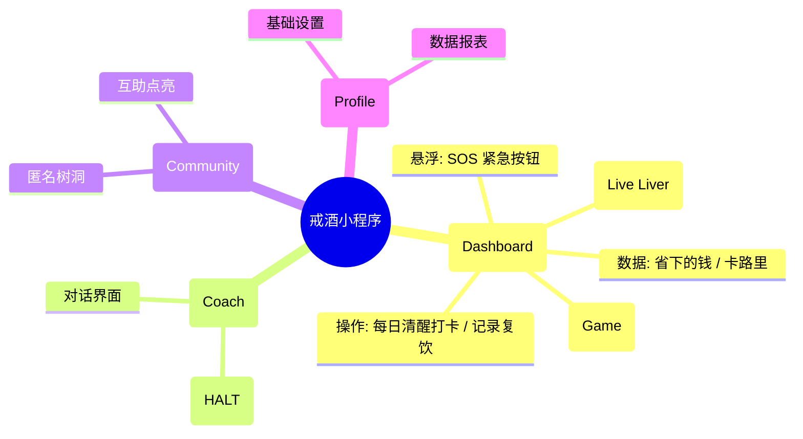
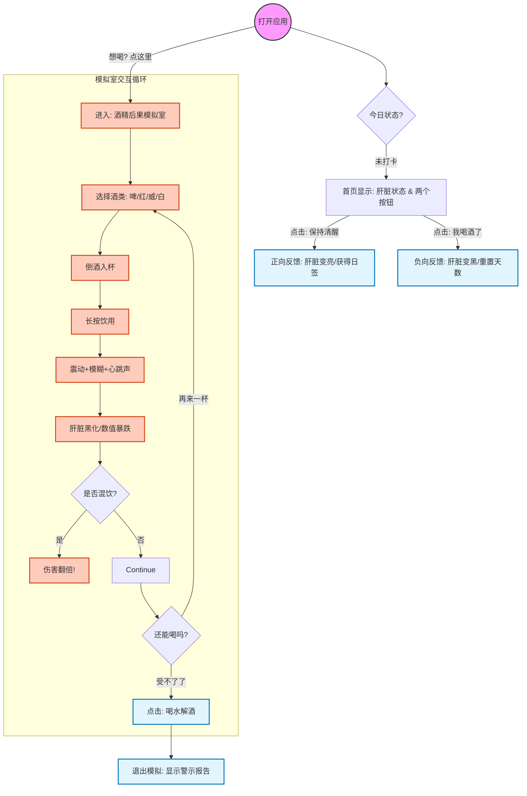

# 产品需求文档 (PRD)：清醒时光 (SoberCheck)

> **文档状态**: V1.1 (完整版)  
> **最后更新**: 2026-01-XX  
> **文档作者**: [bowei]  
> **项目类型**: 微信小程序 

---

## 1. 项目概述 (Project Overview)

### 1.1 背景与痛点
酒精依赖是一个复杂的生理和心理问题。传统戒酒工具枯燥乏味，缺乏即时反馈。用户往往因为“看不见伤害”而心存侥幸，又因为“看不见恢复”而半途而废。

### 1.2 产品愿景
打造一款**“可视化、游戏化、AI化”**的口袋戒酒教练。
* **可视化**：将看不见的肝脏健康变成看得见的“电子宠物”（生命肝脏）。
* **游戏化**：通过模拟饮酒小游戏（后果模拟室），让用户在虚拟世界体验“后果”，从而在现实中保持清醒。
* **AI化**：提供 24h 情感陪伴与危机干预。

### 1.3 核心用户画像
* **视觉型用户**：需要看到具体变化才有动力坚持。
* **冲动型饮酒者**：容易在特定场景（聚会、压力）下破戒，需要“后果模拟”来震慑。

---

## 2. 产品架构与核心流程 (Architecture & Flows)

### 2.1 产品功能架构图 (IA Map)

### 2.2 核心业务流程图 (Core User Flow)

包含 **“每日打卡闭环”** 和 **“后果模拟体验”** 两条核心路径。

---

## 3. 功能详情 (Functional Requirements)

### 3.1 F1: 首页仪表盘与生命肝脏 (Dashboard & Living Liver) [P0]

#### F1.1 正向打卡机制

* **设计逻辑**：首页主要服务于“成功场景”。
* **主按钮**：**“今日清醒打卡”**。点击后，屏幕飘落金币（代表省下的钱），清醒天数+1。
* **次级入口**：**“记录饮酒”**（折叠或位于角落）。点击后进入复盘流程，扣除健康值，不进行道德审判。

#### F1.2 生命肝脏系统 (The Living Liver)

* **定义**：一个 3D 渲染或高质量插画风格的肝脏模型，作为用户健康的直观映射。
* **状态演变表**：

| 阶段 | 清醒时长 | 视觉描述 | 动画/特效 |
| --- | --- | --- | --- |
| **危机期** | 复饮 / 初始 | **深褐色/暗红色**，表面粗糙，有炎症斑点。 | 沉重且缓慢的跳动，背景灰暗。 |
| **修复期** | 1 - 7 天 | **红褐色转浅红**，消肿，斑点开始消退。 | 跳动变有力，偶尔出现绿色修复粒子光效。 |
| **健康期** | 30 天+ | **粉嫩有光泽**，表面光滑。 | 轻盈跳动，背景明亮清澈。 |
| **完美期** | 90 天+ | **晶莹剔透**，散发金色柔光。 | 超级形态，拥有神圣感的光环。 |

* **交互**：点击肝脏，弹出 Tooltip 显示医学数据（如：“脂肪肝风险已降低 15%”）。

---

### 3.2 F2: 酒精后果模拟室 (The Simulation Lab) [P1]

> **设计目的**：利用“虚拟宣泄”和“恐惧管理”，在用户想喝酒时，通过模拟体验打消现实念头。

#### 2.1 界面与道具

* **视觉风格**：半透明人体透视视角，科技感与医学感结合。
* **道具库**：
* **啤酒** + 扎啤杯 (伤害值: Low)
* **红酒** + 高脚杯 (伤害值: Mid)
* **威士忌** + 古典杯 (伤害值: High)
* **白酒** + 小酒盅 (伤害值: Critical)
* **解酒水** (特殊道具：用于恢复)

#### 2.2 核心交互逻辑

1. **选酒与倒酒**：点击酒瓶，酒液伴随逼真的 `液体声效`（咕嘟声）注入对应的杯中。
2. **沉浸式饮用**：
* 用户需 **长按酒杯** 模拟喝酒。
* **触感反馈**：手机随吞咽节奏震动。随着摄入量增加，震动变得杂乱、狂暴。

3. **实时后果反馈**：
* **视觉**：屏幕应用 `模糊滤镜` 和 `重影特效`，模拟醉酒视角。
* **听觉**：背景音中出现耳鸣声、沉重的心跳声。
* **器官**：界面中央的肝脏模型迅速变黑、出现斑点、抽搐。

4. **混饮伤害叠加 (Combo System)**：
* 如果在短时间内切换酒类（如喝完啤酒喝白酒），触发 **“混饮暴击”**。
* 系统弹幕警告：“混饮导致吸收率提升 200%！肝脏超负荷！”
* 健康数值呈指数级下跌。

#### 2.3 结束与救赎

* **休克模拟**：当伤害值爆表，屏幕瞬间黑屏，模拟“断片/送医”。
* **一键清醒 (Redemption)**：
* 提供一杯“虚拟矿泉水”。点击饮用后，滤镜逐渐清晰，肝脏颜色缓慢回升。
* **结语**：弹出卡片 —— “在虚拟世界你可以重来，但现实的肝脏只有这一个。”

---

### 3.3 F3: SOS 紧急干预 [P0]

* **入口**：全局悬浮红色按钮。
* **功能**：
* **呼吸练习**：4-7-8 呼吸法引导动画。
* **正念音频**：5分钟情绪安抚。
* **一键求助**：拨打预设的紧急联系人或心理热线。

### 3.4 F4: AI 戒酒教练 [P1]

* **HALT 模型**：对话时自动识别用户是否处于 Hungry, Angry, Lonely, Tired 状态，并给出针对性建议。
* **场景演练**：提供拒酒话术（如：“我正在吃头孢，不能喝”）。

---

## 4. 商业与风险 (Business & Risk)

### 4.1 商业化路径

* **ToC (Freemium)**：
* 免费：基础打卡、模拟室（每日限次）。
* 会员：解锁“超级肝脏皮肤”、无限次模拟体验、AI 深度咨询。

* **ToB (EAP)**：为企业提供员工健康管理工具。

### 4.2 风险控制

| 风险类型 | 应对策略 |
| --- | --- |
| **诱导风险** | 模拟室必须强调“负面后果”，严禁美化饮酒体验（如不能出现愉悦的派对音乐）。 |
| **生命安全** | 监测 AI 对话中的自杀/自残倾向，触发时强制弹出心理危机干预热线。 |
| **法律合规** | 显著位置标注“本工具数据仅供参考，不作为医疗诊断依据”。 |

---

## 5. 数据埋点需求 (Tracking)

| 事件名称 | 触发时机 | 关键参数 | 目的 |
| --- | --- | --- | --- |
| `sim_enter` | 进入模拟室 | source (来源) | 了解功能渗透率 |
| `sim_drink_action` | 模拟饮酒 | `drink_type` (酒类), `duration` (长按时间) | 分析用户偏好 |
| `sim_mix_drink` | 触发混饮 | - | 统计高危行为模拟 |
| `sim_redemption` | 点击喝水清醒 | - | 验证教育效果 |
| `streak_broken` | 记录真实复饮 | `days_prior` (坚持了几天) | 分析复饮周期 |

### 6. 界面和使用感觉要求

* **界面样子：**
    * 必须使用 **TDesign Weixin** 组件库。
    * 表单、输入框等看起来风格统一、简洁、好看。（参考：https://tdesign.tencent.com/miniprogram/getting-started）